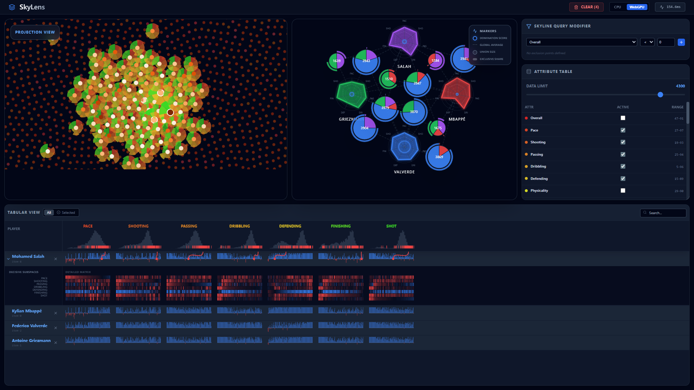

# Skylens

This project is a **re-implementation (and extension)** of the visual analytics system from the paper:

**Xun Zhao, Yanhong Wu, Weiwei Cui, Xinnan Du, Yuan Chen, Yong Wang, Dik Lun Lee & Huamin Qu**, *SkyLens: Visual Analysis of Skyline on Multi-Dimensional Data*, **IEEE Transactions on Visualization and Computer Graphics (TVCG)**, 2018 (presented at IEEE VIS 2017).  

The goal of this project is to re-implement and extend the **SkyLens** visual analytic system, which helps users:

- Identify superior (skyline) points in a multi-dimensional dataset.
- Explore why these points are part of the skyline.
- Analyze skyline relationships and compare skyline items visually.

In addition to re-implementation, this version include GPU-CPU comparison with WebGPU with adaptable data size.  

## How to start

1. Install dependencies:
   `npm install`
2. Run the app:
   `npm run dev`

## How to use?
On the right, you can select attributes or filter attribute values. To clear the selected players, click "CLEAR" in the upper right corner.
You can use Hoover to view a detailed radar chart of the players in the comparison view. Alternatively, you can choose to view a pie chart showing the dominance of two players.
If the GPU is available, you can also switch between CPU/GPU computing mode.
